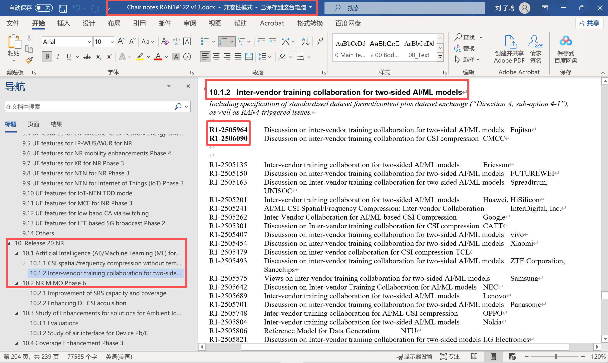

# wiki

欢迎师弟师妹~

这是一个简单的文档，简单记叙了一些入学后你们可能遇到的问题。因为时间不多，所以更多的是给一个关键词或者链接。需要大家根据关键词/链接内容自己做进一步的查找。

本人的预想是这个文档是一个长期演进的。甚至可以把自己对科研的感悟、文献综述结果一起演进到这里供大家分享。在此只是一个抛砖引玉。

### 0. 工具

命令行终端工具：mobaxterm[MobaXterm free Xserver and tabbed SSH client for Windows](https://mobaxterm.mobatek.net/)

+ 作为控制台连服务器用的，包括文件系统，密码保存功能

服务器远程传输工具：filezilla[FileZilla - The free FTP solution](https://filezilla-project.org/)（有时候也用百度云）

+ 用于大文件服务器传输

梯子：[登录 — FlyingBird](https://fbweb01.getxlx.com/auth/login)、https://xn--1-q07a56pdss.com/

+ 翻墙用，Google scholar、github、hugging face等网页

大模型：多模态相关的国内豆包、国外Gemini。代码可以用claude。GPT本体也可以

代码管理git[Git - Downloads](https://git-scm.com/downloads)

+ 这个不一定用得上，但是有时候代码迭代，多机同步、迁移配好了还是比较舒服的

笔记工具：vscode可以写markdown、typora也很舒服

latex工具：overleaf

文献管理：Endnote、Noteexpress、Zotero[(40 封私信 / 15 条消息) 超详细！文献管理软件对比——Endnote、Noteexpress、Zotero、Citavi - 知乎](https://zhuanlan.zhihu.com/p/348608795)

+ 这个我没咋试过，欢迎测评后更新

论文阅读工具：pdf阅读：adobe acrobat。中英文事实翻译文献阅读（强推）：[知云文献翻译PC版官网](https://www.zhiyunwenxian.cn/)（有了这个你们就不怕看英文文献了）

### 1. 服务器相关

我们组人少，所以用啥服务器基本上就那几个人。我会有一个表，这里就不放出来的。总之如果遇到了找对应的师兄师姐。

#### 1. 远程登陆

登录手段包括向日葵、mstsc、ssh三种，在表格里是有统计的。这里给出一个ssh远程登陆的配置方式。其他两个很简单

[(40 封私信 / 13 条消息) SSH的两种远程登录方法详解 - 知乎](https://zhuanlan.zhihu.com/p/587777394)

ssh连接软件推荐

| 软件名称  | 说明                                                         |
| --------- | ------------------------------------------------------------ |
| XSHELL    | 免费。[官网链接](https://www.xshell.com/zh/)。可配合XFTP传输文件，可使用登录脚本处理跳板机机逻辑。 |
| MobaXterm | 免费。[官网链接](https://mobaxterm.mobatek.net/)。可以处理需要输出到屏幕的代码，会将输出的图像等显示在本机屏幕上。 |
| SecureCRT | 适合mac使用，有试用期，可寻找破解版。[官网链接](https://www.vandyke.com/products/securecrt/)。 |

#### 2. vscode远程连接

+ 左下角有个小图标

#### 3. ssh免密登录

原理就是直接输入密码有些情况不安全。可以把自己主机的公钥放到服务器上。这样发起请求的时候，服务器检查到你的私钥匹配已经存好的公钥，完成认证，直接允许连接了。

[(40 封私信 / 13 条消息) SSH的两种远程登录方法详解 - 知乎](https://zhuanlan.zhihu.com/p/587777394)

[vscode远程开发，含ssh密钥配置（免密登录）、客户端多私钥配置。_vscode ssh 密钥-CSDN博客](https://blog.csdn.net/hayreen/article/details/109225507)

### 2. 科研相关的

#### 1. 文献查询

一般用Google scholar，然后大部分Google scholar的文献都出自IEEE，所以其实是一样的。

[Google Scholar](https://scholar.google.com/)

[IEEE Xplore](https://ieeexplore.ieee.org/Xplore/home.jsp)

#### 2. 文稿查询

通信行业一大特色就是标准化。标准化有助于行业进步，在现在的行业发展里是不可或缺的技术。4G、5G都是标准化的结果。在标准化组织3GPP中，各公司将就通信的一些技术、接口达成共识。遵循着共识，各公司又发展各自的产品。在通信领域，不遵循标准的工作是没有意义是不被认可的。[(40 封私信 / 15 条消息) 5G标准及3GPP工作组详细介绍 - 知乎](https://zhuanlan.zhihu.com/p/619347100)

标准化是长期演进的东西，组里有涉及标准化的项目，那么如何查看标准化的最新进展呢？

[Directory Listing /ftp/tsg_ran/WG1_RL1/](https://www.3gpp.org/ftp/tsg_ran/WG1_RL1/)这一链接代表是3GPP官方的文件下载路径。RL1表示RAN1层级。TSGR1_xxx表示第xxx次会议。RAN1最新一次会是122

你可以在inbox侧下载chair_notes。这是本次会议的核心大纲。但这里面东西可能会比较多。你可以找到关注的章节。比如我关注R20的AI+CSI，我通过目录跳转到当前的页面。这下面有一系列的文稿号，如R1-2505201是华为海思在本次会议，就10.1.2这个议题所提出的提案（也可以叫做文稿，草稿性质的，需要讨论，并没有达成通过的正在演进的东西）。你可以在`www.3gpp.org / ftp / tsg_ran / WG1_RL1 / TSGR1_122 / Docs`进行搜索，找到确切的文稿。

+ 一般看华为、高通、OPPO、Nokia（诺基亚）、CMCC（中国移动）几个比较有名的公司（纯看你的喜好）

#### 3. 专利查询

我也不会，没查过，欢迎补充

### 3. 代码管理git

推荐廖雪峰的教程[简介 - Git教程 - 廖雪峰的官方网站](https://liaoxuefeng.com/books/git/introduction/index.html)

### 4. python环境配置

一般是vscode/Pycharm——如果你要用pycharm请一定整专业版，不然你没法远程连接服务器。

一般用anaconda这个包管理工具

[(40 封私信 / 15 条消息) Anaconda安装教程（2025年保姆级超详解）【附安装包+环境玩转指南】 - 知乎](https://zhuanlan.zhihu.com/p/1896552549621936802)

+ 建议一定要添加国内镜像（否则你就会体验下一个环境3个小时最后网络波动断了，环境没下好重新下的爽感）

python入门的话……python不太需要入门，直接上手就好。

+ 读代码和写代码初期都可以让AI给你写或解释。（当然不要太依赖AI）

### 5. 入门AI

现在的项目八成以上都会用到AI技术。AI技术不存在很大的门槛，借助大模型，你可以零基础写AI代码。但对于AI你可能也需要一些理解。

理论课：[[双语字幕\]吴恩达深度学习deeplearning.ai_哔哩哔哩_bilibili](https://www.bilibili.com/video/BV1FT4y1E74V/?spm_id_from=333.337.search-card.all.click&vd_source=df29b8e0b860a286ce34aafeccfd709d)

动手课（从配pytorch环境开始）：[PyTorch深度学习快速入门教程（绝对通俗易懂！）【小土堆】_哔哩哔哩_bilibili](https://www.bilibili.com/video/BV1hE411t7RN/?spm_id_from=333.337.search-card.all.click&vd_source=df29b8e0b860a286ce34aafeccfd709d)

+ 需要注意的是：AI已经火了很久，这种基础性的课程只能帮助你理解一些基本的概念，和上手搭一些最简单的东西。适用于纯小白。如果你已经有AI基础，可以无视。

AI相关的论文：李沐一个系列的讲论文。可以看看，想idea的时候可能有用。[BERT 论文逐段精读【论文精读】_哔哩哔哩_bilibili](https://www.bilibili.com/video/BV1PL411M7eQ/?spm_id_from=333.337.top_right_bar_window_custom_collection.content.click)

大模型基础课：[【斯坦福大学 • CS336】从零开始构建语言模型 | 2025 年春季_哔哩哔哩_bilibili](https://www.bilibili.com/video/BV1pAjUzYEaK/?spm_id_from=333.1007.top_right_bar_window_custom_collection.content.click)

+ 这个课不是做应用的，是很多底层基础，真的感兴趣且想做深才可能会用到。

长期演进ing....

